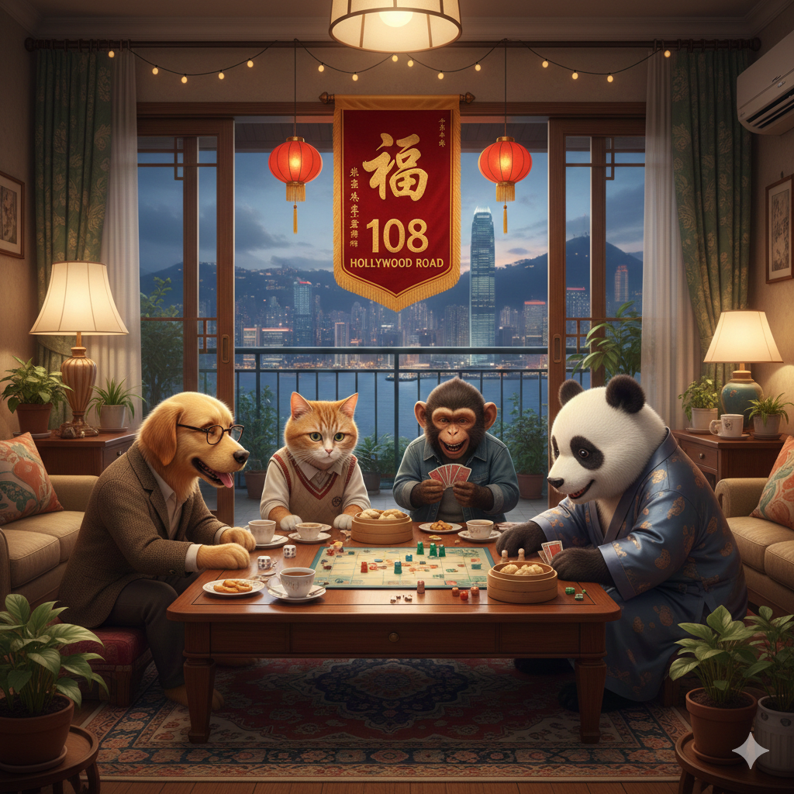

### Overall Rankings

| Player | Score | Wins | Losses | Win % |
| --- | --- | --- | --- | --- |
| Garrick | 110.70 | 11 | 9 | 55% |
| Feli | 107.60 | 4 | 4 | 50% |
| Harsha | 105.40 | 1 | 1 | 50% |
| Emma | 103.60 | 3 | 0 | 100% |
| Bosco(Vivian) | 102.80 | 3 | 1 | 75% |
| Gillian | 102.80 | 3 | 1 | 75% |
| Summer | 102.70 | 4 | 6 | 40% |
| Mia | 102.70 | 2 | 0 | 100% |
| Leo | 102.70 | 0 | 1 | 0% |
| Kristy | 102.40 | 2 | 0 | 100% |
| Phoebe | 102.20 | 2 | 3 | 40% |
| Amy | 102.10 | 2 | 1 | 67% |
| Wincy | 101.80 | 2 | 2 | 50% |
| Howard | 101.70 | 2 | 3 | 40% |
| Allan | 101.70 | 1 | 0 | 100% |
| Oliver | 101.40 | 11 | 9 | 55% |
| Harsh | 100.70 | 3 | 5 | 38% |
| Anna | 100.40 | 1 | 1 | 50% |
| Egor | 99.70 | 2 | 3 | 40% |
| Vivian | 99.60 | 1 | 2 | 33% |
| Peter | 99.20 | 0 | 1 | 0% |
| Elina(Egor) | 99.20 | 0 | 1 | 0% |
| Jovan | 99.10 | 1 | 2 | 33% |
| Tyler | 99.10 | 1 | 2 | 33% |
| Tara | 99.00 | 1 | 8 | 11% |
| Jane | 98.80 | 1 | 4 | 20% |
| NicoleHu | 98.60 | 0 | 2 | 0% |
| Alima | 98.40 | 0 | 2 | 0% |
| Alexandra | 92.60 | 0 | 3 | 0% |

### Rankings over Time

### Bang

| Player | Wins | Losses | Win % |
| --- | --- | --- | --- |
| Oliver | 2 | 1 | 67% |
| Garrick | 2 | 1 | 67% |
| Feli | 1 | 0 | 100% |
| Mia | 1 | 0 | 100% |
| Harsh | 1 | 2 | 33% |
| Phoebe | 0 | 1 | 0% |
| Summer | 0 | 3 | 0% |
| Jane | 0 | 2 | 0% |
| Tara | 0 | 3 | 0% |

### Camel Up

| Player | Wins | Losses | Win % |
| --- | --- | --- | --- |
| Harsha | 1 | 0 | 100% |
| Feli | 0 | 1 | 0% |
| Leo | 0 | 1 | 0% |
| Garrick | 0 | 1 | 0% |
| Tyler | 0 | 1 | 0% |
| Oliver | 0 | 1 | 0% |
| Alexandra | 0 | 1 | 0% |

### Codenames

| Player | Wins | Losses | Win % |
| --- | --- | --- | --- |
| Bosco(Vivian) | 1 | 0 | 100% |
| Anna | 1 | 0 | 100% |
| Jane | 1 | 0 | 100% |
| Emma | 1 | 0 | 100% |
| Amy | 1 | 0 | 100% |
| Garrick | 1 | 1 | 50% |
| Oliver | 1 | 1 | 50% |
| Harsh | 0 | 1 | 0% |
| Wincy | 0 | 1 | 0% |
| Jovan | 0 | 1 | 0% |
| Tara | 0 | 1 | 0% |
| Vivian | 0 | 1 | 0% |
| Gillian | 0 | 1 | 0% |

### Exploding Kittens

| Player | Wins | Losses | Win % |
| --- | --- | --- | --- |
| Phoebe | 1 | 0 | 100% |
| Howard | 0 | 1 | 0% |
| Feli | 0 | 1 | 0% |
| Oliver | 0 | 1 | 0% |
| Garrick | 0 | 1 | 0% |
| NicoleHu | 0 | 1 | 0% |
| Egor | 0 | 1 | 0% |

### Incan Gold

| Player | Wins | Losses | Win % |
| --- | --- | --- | --- |
| Garrick | 1 | 1 | 50% |
| Tara | 0 | 2 | 0% |
| Summer | 1 | 1 | 50% |
| Oliver | 0 | 2 | 0% |

### Quest

| Player | Wins | Losses | Win % |
| --- | --- | --- | --- |
| Garrick | 3 | 0 | 100% |
| Feli | 2 | 1 | 67% |
| Howard | 2 | 1 | 67% |
| Kristy | 1 | 0 | 100% |
| Oliver | 2 | 1 | 67% |
| Wincy | 1 | 1 | 50% |
| Phoebe | 0 | 1 | 0% |
| NicoleHu | 0 | 1 | 0% |
| Egor | 1 | 2 | 33% |
| Alima | 0 | 2 | 0% |

### Secret Hitler

| Player | Wins | Losses | Win % |
| --- | --- | --- | --- |
| Oliver | 5 | 2 | 71% |
| Gillian | 3 | 0 | 100% |
| Summer | 3 | 2 | 60% |
| Emma | 2 | 0 | 100% |
| Garrick | 4 | 3 | 57% |
| Vivian | 1 | 0 | 100% |
| Allan | 1 | 0 | 100% |
| Harsh | 2 | 2 | 50% |
| Kristy | 1 | 0 | 100% |
| Egor | 1 | 0 | 100% |
| Mia | 1 | 0 | 100% |
| Amy | 1 | 1 | 50% |
| Phoebe | 1 | 1 | 50% |
| Feli | 1 | 1 | 50% |
| Tyler | 1 | 1 | 50% |
| Tara | 1 | 2 | 33% |
| Bosco(Vivian) | 1 | 1 | 50% |
| Jovan | 1 | 1 | 50% |
| Peter | 0 | 1 | 0% |
| Howard | 0 | 1 | 0% |
| Elina(Egor) | 0 | 1 | 0% |
| Harsha | 0 | 1 | 0% |
| Anna | 0 | 1 | 0% |
| Alexandra | 0 | 2 | 0% |
| Jane | 0 | 2 | 0% |

### Wavelength

| Player | Wins | Losses | Win % |
| --- | --- | --- | --- |
| Wincy | 1 | 0 | 100% |
| Oliver | 1 | 0 | 100% |
| Bosco(Vivian) | 1 | 0 | 100% |
| Garrick | 0 | 1 | 0% |
| Vivian | 0 | 1 | 0% |
