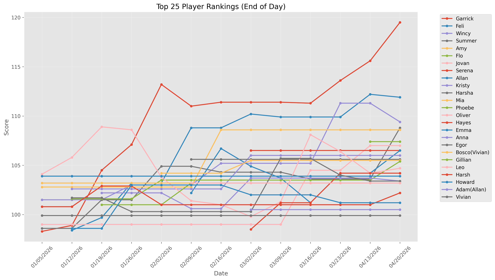

### Overall Rankings

| Player | ELO | Wins | Losses | Win % |
| --- | --- | --- | --- | --- |
| Garrick | 121.64 | 40 | 32 | 56% |
| Rachel | 105.18 | 3 | 2 | 60% |
| Oliver | 104.60 | 42 | 47 | 47% |
| Wincy | 104.14 | 14 | 13 | 52% |
| Katie | 98.63 | 12 | 11 | 52% |
| Jovan | 93.58 | 4 | 7 | 36% |
| Allan | 92.65 | 8 | 19 | 30% |
| Nicole(Tyler) | 83.53 | 3 | 2 | 60% |
| Tyler | 82.32 | 7 | 8 | 47% |
| Jack | 78.80 | 6 | 15 | 29% |
| Anna | 77.06 | 21 | 21 | 50% |
| Nicole | 76.96 | 9 | 16 | 36% |
| Feli | 73.93 | 8 | 20 | 29% |
| Jane | 72.38 | 3 | 11 | 21% |
| Serene | 69.04 | 1 | 3 | 25% |
| Ruby | 68.69 | 2 | 3 | 40% |
| Susan | 67.83 | 2 | 4 | 33% |
| Amy | 64.94 | 4 | 8 | 33% |
| Viv | 64.85 | 9 | 7 | 56% |
| Leo | 63.30 | 7 | 13 | 35% |
| Heidi | 62.01 | 2 | 2 | 50% |
| Peter | 54.03 | 3 | 6 | 33% |
| Kristy | 52.60 | 2 | 5 | 29% |
| Narin | 50.68 | 3 | 5 | 38% |
| Vittoria | 47.05 | 3 | 6 | 33% |
| Lil Su | 44.02 | 0 | 2 | 0% |
| Abhi | 43.11 | 6 | 10 | 38% |
| Angela(Oliver) | 39.45 | 1 | 1 | 50% |
| Alima | 38.29 | 2 | 8 | 20% |
| Jacky(Feli) | 35.70 | 3 | 1 | 75% |
| Phoebe | 34.32 | 2 | 6 | 25% |
| Vivian | 32.08 | 3 | 0 | 100% |
| Kristy(Kristy) | 21.25 | 0 | 1 | 0% |
| Kuki | 21.25 | 0 | 5 | 0% |
| Bonnie | 18.99 | 1 | 2 | 33% |
| Summer | 17.23 | 3 | 1 | 75% |
| Babs | 17.23 | 3 | 1 | 75% |
| Angelica(Feli) | 14.79 | 1 | 1 | 50% |
| Simon | 7.68 | 0 | 1 | 0% |
| Howard | 4.86 | 5 | 5 | 50% |
| Kristy(Katie) | -11.56 | 0 | 4 | 0% |
| Jordan | -25.42 | 2 | 1 | 67% |
| Karen | -33.11 | 2 | 2 | 50% |
| Tara | -41.56 | 1 | 3 | 25% |
| Angelica | -54.76 | 1 | 0 | 100% |
| Gloria | -56.43 | 1 | 1 | 50% |
| David(Aus) | -64.75 | 1 | 2 | 33% |
| Kevin(Aus) | -64.75 | 1 | 2 | 33% |
| Freya | -70.13 | 0 | 2 | 0% |
| Mandy | -70.69 | 2 | 2 | 50% |
| Harsha | -74.30 | 3 | 5 | 38% |
| Eric | -92.49 | 0 | 4 | 0% |
| Myron | -93.04 | 1 | 2 | 33% |
| Jonathan(Oliver) | -104.07 | 1 | 1 | 50% |
| Michael | -112.81 | 0 | 3 | 0% |
| LeoPan | -134.86 | 1 | 2 | 33% |

### Rankings over Time

### Bang

| Player | ELO | Wins | Losses | Win % |
| --- | --- | --- | --- | --- |
| Garrick | 43.73 | 6 | 5 | 55% |
| Jovan | 27.70 | 1 | 1 | 50% |
| Jane | 21.71 | 2 | 1 | 67% |
| Katie | 11.91 | 2 | 1 | 67% |
| Viv | 6.45 | 2 | 0 | 100% |
| Jack | 5.61 | 1 | 4 | 20% |
| Oliver | 2.03 | 4 | 7 | 36% |
| Nicole | -2.59 | 1 | 2 | 33% |
| Leo | -27.87 | 2 | 1 | 67% |
| Tara | -29.34 | 1 | 0 | 100% |
| Serene | -32.38 | 1 | 0 | 100% |
| Howard | -42.64 | 1 | 0 | 100% |
| Feli | -46.23 | 1 | 2 | 33% |
| Anna | -65.78 | 0 | 4 | 0% |
| Wincy | -67.48 | 0 | 2 | 0% |
| Eric | -70.13 | 0 | 2 | 0% |
| Karen | -70.13 | 0 | 2 | 0% |
| Freya | -70.13 | 0 | 2 | 0% |
| Michael | -87.24 | 0 | 1 | 0% |
| Alima | -100.48 | 0 | 1 | 0% |
| Amy | -100.48 | 0 | 1 | 0% |

### Secret Hitler

| Player | ELO | Wins | Losses | Win % |
| --- | --- | --- | --- | --- |
| Oliver | 75.17 | 14 | 4 | 78% |
| Garrick | 36.36 | 12 | 5 | 71% |
| Anna | 14.14 | 8 | 5 | 62% |
| Wincy | 13.50 | 7 | 2 | 78% |
| Viv | -17.37 | 4 | 1 | 80% |
| Nicole | -29.81 | 5 | 1 | 83% |
| Heidi | -39.81 | 1 | 1 | 50% |
| Karen | -44.66 | 2 | 0 | 100% |
| Summer | -55.10 | 1 | 1 | 50% |
| Babs | -55.10 | 1 | 1 | 50% |
| Jack | -62.03 | 2 | 3 | 40% |
| Abhi | -65.21 | 3 | 4 | 43% |
| Allan | -74.24 | 2 | 3 | 40% |
| Vittoria | -78.74 | 1 | 1 | 50% |
| Vivian | -80.44 | 1 | 0 | 100% |
| Angela(Oliver) | -81.20 | 1 | 0 | 100% |
| Angelica(Feli) | -81.20 | 1 | 0 | 100% |
| Jonathan(Oliver) | -81.20 | 1 | 0 | 100% |
| Katie | -82.04 | 2 | 2 | 50% |
| Peter | -87.78 | 1 | 2 | 33% |
| Tyler | -88.66 | 1 | 1 | 50% |
| Mandy | -91.00 | 1 | 1 | 50% |
| Howard | -101.01 | 1 | 2 | 33% |
| Amy | -101.72 | 2 | 2 | 50% |
| Tara | -104.94 | 0 | 1 | 0% |
| Myron | -104.94 | 0 | 1 | 0% |
| Harsha | -106.72 | 1 | 3 | 25% |
| Kuki | -108.69 | 0 | 1 | 0% |
| Jordan | -109.73 | 0 | 1 | 0% |
| Nicole(Tyler) | -110.88 | 0 | 1 | 0% |
| Rachel | -110.88 | 0 | 1 | 0% |
| Bonnie | -112.60 | 0 | 1 | 0% |
| Ruby | -115.04 | 1 | 1 | 50% |
| Kevin(Aus) | -117.37 | 0 | 1 | 0% |
| David(Aus) | -117.37 | 0 | 1 | 0% |
| LeoPan | -117.37 | 0 | 1 | 0% |
| Kristy | -119.60 | 1 | 1 | 50% |
| Leo | -123.05 | 1 | 3 | 25% |
| Feli | -123.98 | 2 | 6 | 25% |
| Michael | -127.15 | 0 | 2 | 0% |
| Susan | -129.47 | 0 | 1 | 0% |
| Kristy(Katie) | -129.47 | 0 | 1 | 0% |
| Eric | -131.62 | 0 | 2 | 0% |
| Jane | -147.36 | 0 | 3 | 0% |

### Codenames

| Player | ELO | Wins | Losses | Win % |
| --- | --- | --- | --- | --- |
| Garrick | 25.28 | 11 | 5 | 69% |
| Wincy | 12.03 | 5 | 1 | 83% |
| Katie | -11.06 | 4 | 1 | 80% |
| Jacky(Feli) | -33.72 | 2 | 0 | 100% |
| Nicole(Tyler) | -35.39 | 2 | 0 | 100% |
| Rachel | -35.39 | 2 | 0 | 100% |
| Vivian | -40.61 | 2 | 0 | 100% |
| Leo | -42.25 | 3 | 2 | 60% |
| Angelica | -49.59 | 1 | 0 | 100% |
| Jordan | -49.59 | 1 | 0 | 100% |
| Summer | -54.19 | 2 | 0 | 100% |
| Babs | -54.19 | 2 | 0 | 100% |
| Anna | -55.25 | 7 | 7 | 50% |
| Tyler | -55.81 | 4 | 3 | 57% |
| Narin | -62.66 | 1 | 0 | 100% |
| David(Aus) | -67.38 | 1 | 1 | 50% |
| Kevin(Aus) | -67.38 | 1 | 1 | 50% |
| Myron | -68.25 | 1 | 1 | 50% |
| Abhi | -70.08 | 3 | 4 | 43% |
| Bonnie | -71.66 | 1 | 0 | 100% |
| Mandy | -75.74 | 1 | 1 | 50% |
| Vittoria | -75.74 | 1 | 1 | 50% |
| Harsha | -78.84 | 2 | 2 | 50% |
| Howard | -84.17 | 2 | 2 | 50% |
| Phoebe | -87.91 | 2 | 4 | 33% |
| Allan | -89.82 | 2 | 4 | 33% |
| Peter | -95.06 | 1 | 2 | 33% |
| Jack | -97.05 | 1 | 2 | 33% |
| Oliver | -99.77 | 7 | 11 | 39% |
| Gloria | -103.20 | 1 | 1 | 50% |
| Feli | -105.54 | 2 | 4 | 33% |
| LeoPan | -108.62 | 1 | 1 | 50% |
| Viv | -108.62 | 1 | 1 | 50% |
| Alima | -117.03 | 0 | 1 | 0% |
| Amy | -120.50 | 0 | 2 | 0% |
| Kuki | -132.39 | 0 | 2 | 0% |
| Nicole | -132.75 | 2 | 6 | 25% |
| Jovan | -133.01 | 0 | 2 | 0% |
| Kristy(Katie) | -140.28 | 0 | 2 | 0% |
| Tara | -142.89 | 0 | 2 | 0% |
| Jane | -169.83 | 0 | 5 | 0% |

### Monopoly Deal

| Player | ELO | Wins | Losses | Win % |
| --- | --- | --- | --- | --- |
| Oliver | 46.23 | 2 | 4 | 33% |
| Garrick | 43.15 | 2 | 3 | 40% |
| Narin | 25.89 | 1 | 0 | 100% |
| Feli | -6.85 | 1 | 1 | 50% |
| Allan | -9.44 | 0 | 1 | 0% |
| Susan | -10.65 | 0 | 2 | 0% |
| Leo | -11.58 | 0 | 2 | 0% |
| Serene | -11.58 | 0 | 2 | 0% |
| Katie | -19.13 | 0 | 1 | 0% |
| Jane | -19.13 | 0 | 1 | 0% |
| Phoebe | -19.13 | 0 | 1 | 0% |
| Nicole | -25.61 | 0 | 1 | 0% |
| Simon | -25.61 | 0 | 1 | 0% |

### Coup

| Player | ELO | Wins | Losses | Win % |
| --- | --- | --- | --- | --- |
| Oliver | 26.45 | 1 | 5 | 17% |
| Allan | 15.88 | 1 | 2 | 33% |
| Amy | 13.63 | 1 | 0 | 100% |
| Peter | 13.50 | 1 | 0 | 100% |
| Anna | 13.41 | 1 | 0 | 100% |
| Jack | 10.51 | 1 | 0 | 100% |
| Garrick | 8.09 | 0 | 4 | 0% |
| Feli | -5.29 | 0 | 2 | 0% |
| Narin | -18.67 | 0 | 2 | 0% |
| Ruby | -20.76 | 0 | 1 | 0% |
| Susan | -24.89 | 0 | 1 | 0% |
| Katie | -24.89 | 0 | 1 | 0% |
| Kristy(Kristy) | -24.89 | 0 | 1 | 0% |
| Serene | -30.17 | 0 | 1 | 0% |
| Leo | -30.17 | 0 | 1 | 0% |
| Kristy | -32.67 | 0 | 1 | 0% |
| Alima | -32.67 | 0 | 1 | 0% |

### Avalon

| Player | ELO | Wins | Losses | Win % |
| --- | --- | --- | --- | --- |
| Viv | -60.26 | 1 | 0 | 100% |
| Jacky(Feli) | -60.26 | 1 | 0 | 100% |
| Susan | -68.35 | 1 | 0 | 100% |
| Jordan | -68.35 | 1 | 0 | 100% |
| Feli | -81.76 | 1 | 1 | 50% |
| Oliver | -81.76 | 1 | 1 | 50% |
| Garrick | -81.76 | 1 | 1 | 50% |
| Leo | -92.11 | 1 | 1 | 50% |
| Vittoria | -118.75 | 0 | 1 | 0% |
| Tyler | -118.75 | 0 | 1 | 0% |
| Jovan | -125.13 | 0 | 1 | 0% |
| Anna | -125.13 | 0 | 1 | 0% |

### Exploding Kittens

| Player | ELO | Wins | Losses | Win % |
| --- | --- | --- | --- | --- |
| Oliver | 61.79 | 3 | 1 | 75% |
| Garrick | 29.26 | 1 | 2 | 33% |
| Vittoria | 26.14 | 1 | 1 | 50% |
| Feli | 17.01 | 0 | 3 | 0% |
| Katie | 9.00 | 0 | 2 | 0% |
| Wincy | 4.74 | 0 | 2 | 0% |
| Kristy(Katie) | -10.25 | 0 | 1 | 0% |
| Anna | -10.25 | 0 | 1 | 0% |
| Jack | -10.25 | 0 | 1 | 0% |
| Jacky(Feli) | -10.25 | 0 | 1 | 0% |
| Lil Su | -16.45 | 0 | 1 | 0% |
| Leo | -30.17 | 0 | 1 | 0% |
| Bonnie | -36.92 | 0 | 1 | 0% |
| Phoebe | -36.92 | 0 | 1 | 0% |
| Nicole | -36.92 | 0 | 1 | 0% |
| Allan | -36.92 | 0 | 1 | 0% |

### Incan Gold

| Player | ELO | Wins | Losses | Win % |
| --- | --- | --- | --- | --- |
| Garrick | 84.54 | 1 | 3 | 25% |
| Wincy | 53.61 | 1 | 3 | 25% |
| Oliver | 49.06 | 1 | 8 | 11% |
| Rachel | 39.85 | 1 | 1 | 50% |
| Viv | 31.62 | 0 | 2 | 0% |
| Susan | 31.53 | 1 | 0 | 100% |
| Ruby | 27.51 | 1 | 1 | 50% |
| Amy | 25.47 | 0 | 2 | 0% |
| Heidi | 21.13 | 1 | 1 | 50% |
| Nicole(Tyler) | 15.65 | 1 | 1 | 50% |
| Angela(Oliver) | 14.04 | 0 | 1 | 0% |
| Abhi | 11.09 | 0 | 1 | 0% |
| Jovan | 6.75 | 0 | 2 | 0% |
| Allan | 3.07 | 0 | 4 | 0% |
| Katie | -7.20 | 1 | 2 | 33% |
| Feli | -7.67 | 1 | 1 | 50% |
| Tyler | -11.31 | 0 | 2 | 0% |
| Nicole | -16.41 | 0 | 3 | 0% |
| Peter | -17.49 | 0 | 2 | 0% |
| Jack | -19.30 | 0 | 2 | 0% |
| Vittoria | -22.91 | 0 | 1 | 0% |
| Angelica(Feli) | -22.91 | 0 | 1 | 0% |
| Kuki | -27.51 | 0 | 1 | 0% |
| Jonathan(Oliver) | -150.50 | 0 | 1 | 0% |

### Camel Up

| Player | ELO | Wins | Losses | Win % |
| --- | --- | --- | --- | --- |
| Garrick | 72.03 | 1 | 0 | 100% |
| Tyler | 34.77 | 0 | 1 | 0% |
| Anna | 4.10 | 0 | 1 | 0% |
| Lil Su | 4.10 | 0 | 1 | 0% |
| Katie | -28.20 | 0 | 1 | 0% |
| Oliver | -63.26 | 0 | 1 | 0% |
| Vittoria | -107.87 | 0 | 1 | 0% |
| Viv | -107.87 | 0 | 1 | 0% |

### Shifty Eyed Spies

| Player | ELO | Wins | Losses | Win % |
| --- | --- | --- | --- | --- |
| Katie | 40.25 | 2 | 0 | 100% |
| Garrick | 20.94 | 1 | 1 | 50% |
| Tyler | 13.33 | 1 | 0 | 100% |
| Oliver | 7.21 | 1 | 3 | 25% |
| Jack | -1.33 | 1 | 2 | 33% |
| Kristy | -8.16 | 1 | 1 | 50% |
| Alima | -10.46 | 1 | 1 | 50% |
| Kuki | -32.11 | 0 | 1 | 0% |
| Nicole | -32.11 | 0 | 1 | 0% |
| Abhi | -32.11 | 0 | 1 | 0% |
| Jane | -43.21 | 0 | 1 | 0% |

### Santorini

| Player | ELO | Wins | Losses | Win % |
| --- | --- | --- | --- | --- |
| Allan | -8.88 | 1 | 0 | 100% |
| Oliver | -121.57 | 0 | 1 | 0% |

### Quest

| Player | ELO | Wins | Losses | Win % |
| --- | --- | --- | --- | --- |
| Oliver | 60.49 | 6 | 1 | 86% |
| Anna | -14.33 | 5 | 2 | 71% |
| Jovan | -20.97 | 3 | 1 | 75% |
| Garrick | -49.35 | 4 | 3 | 57% |
| Tyler | -54.35 | 1 | 0 | 100% |
| Katie | -68.35 | 1 | 0 | 100% |
| Jane | -68.35 | 1 | 0 | 100% |
| Allan | -76.83 | 2 | 3 | 40% |
| Howard | -77.66 | 1 | 1 | 50% |
| Amy | -91.63 | 1 | 1 | 50% |
| Nicole | -91.63 | 1 | 1 | 50% |
| Narin | -109.87 | 1 | 3 | 25% |
| Viv | -109.93 | 1 | 2 | 33% |
| Wincy | -116.20 | 1 | 3 | 25% |
| Alima | -117.36 | 1 | 3 | 25% |
| Leo | -129.00 | 0 | 2 | 0% |

### Carcassone

| Player | ELO | Wins | Losses | Win % |
| --- | --- | --- | --- | --- |
| Oliver | -4.27 | 1 | 0 | 100% |
| Kristy | -72.68 | 0 | 1 | 0% |
| Allan | -72.68 | 0 | 1 | 0% |

### Love Letter

| Player | ELO | Wins | Losses | Win % |
| --- | --- | --- | --- | --- |
| Oliver | 4.57 | 1 | 0 | 100% |
| Kristy | -50.87 | 0 | 1 | 0% |
| Jack | -50.87 | 0 | 1 | 0% |
| Alima | -50.87 | 0 | 1 | 0% |
