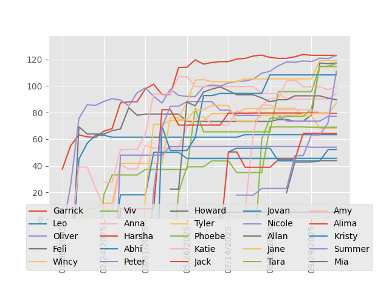

### Total Rankings

| Player | ELO | Wins | Losses | Win % | Best Game |
| --- | --- | --- | --- | --- | --- |
| Harsha | 102.59 | 4 | 2 | 0.67 | Codenames |
| Kyla | 100.40 | 3 | 2 | 0.60 | Codenames |
| Oliver | 98.93 | 3 | 3 | 0.50 | Coup |
| Nancy | 97.87 | 2 | 3 | 0.40 | Secret Hitler |
| Simon | 97.51 | 2 | 4 | 0.33 | Secret Hitler |
| Kenny | 95.39 | 1 | 4 | 0.20 | Codenames |
| Vivienne | 94.78 | 1 | 5 | 0.17 | Secret Hitler |

### Rankings over Time

### Coup

| Player | ELO | Wins | Losses | Win % |
| --- | --- | --- | --- | --- |
| Harsha | 108.04309025941788  | 1 | 1 | 0.50 |
| Oliver | 102.46130247892104  | 1 | 1 | 0.50 |
| Kenny | 96.09974576652814  | 0 | 1 | 0.00 |
| Kyla | 96.09974381223245  | 0 | 1 | 0.00 |
| Nancy | 96.0997384227015  | 0 | 1 | 0.00 |
| Vivienne | 94.38619019104553  | 0 | 2 | 0.00 |
| Simon | 94.38618976365287  | 0 | 2 | 0.00 |

### Secret Hitler

| Player | ELO | Wins | Losses | Win % |
| --- | --- | --- | --- | --- |
| Harsha | 102.57679121823642  | 2 | 1 | 0.67 |
| Simon | 102.57679004984709  | 2 | 1 | 0.67 |
| Oliver | 101.81851694999273  | 2 | 1 | 0.67 |
| Nancy | 101.81851498202253  | 2 | 1 | 0.67 |
| Kyla | 101.22551997873128  | 2 | 1 | 0.67 |
| Vivienne | 97.02093921784352  | 1 | 2 | 0.33 |
| Kenny | 91.91423478860715  | 0 | 3 | 0.00 |

### Codenames

| Player | ELO | Wins | Losses | Win % |
| --- | --- | --- | --- | --- |
| Kenny | 110.38270209992253  | 1 | 0 | 1.00 |
| Kyla | 110.38269785330445  | 1 | 0 | 1.00 |
| Harsha | 110.38269497944066  | 1 | 0 | 1.00 |
| Nancy | 92.21297995713397  | 0 | 1 | 0.00 |
| Oliver | 92.21297682382617  | 0 | 1 | 0.00 |
| Simon | 92.2129764328619  | 0 | 1 | 0.00 |
| Vivienne | 92.21297221027524  | 0 | 1 | 0.00 |